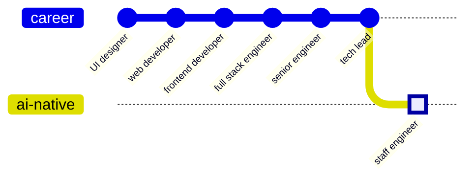

```mermaid
%%{init: {'gitGraph': {'mainBranchName': 'career'}}}%%
gitGraph LR:
  commit id: "UI designer"
  commit id: "web developer"
  commit id: "frontend developer"
  commit id: "full stack engineer"
  commit id: "senior engineer"
  commit id: "tech lead"
  branch ai-native
  commit id: "staff engineer" type: HIGHLIGHT
```
